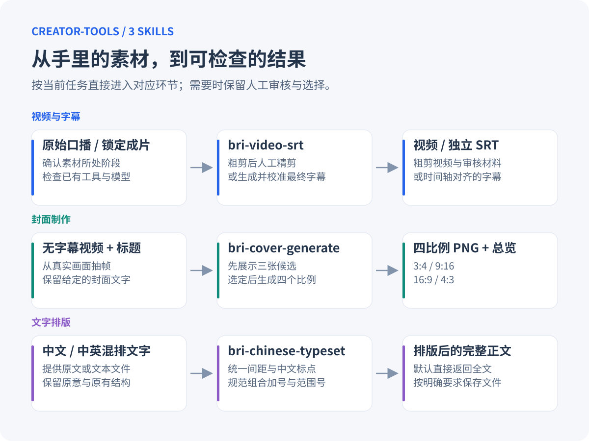
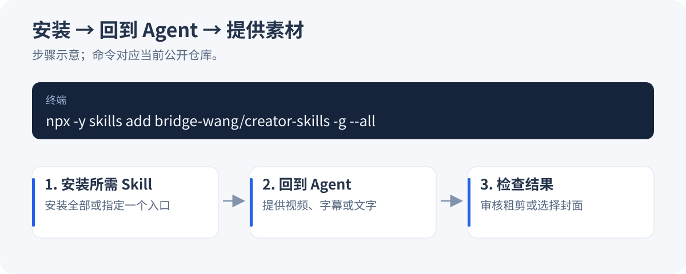
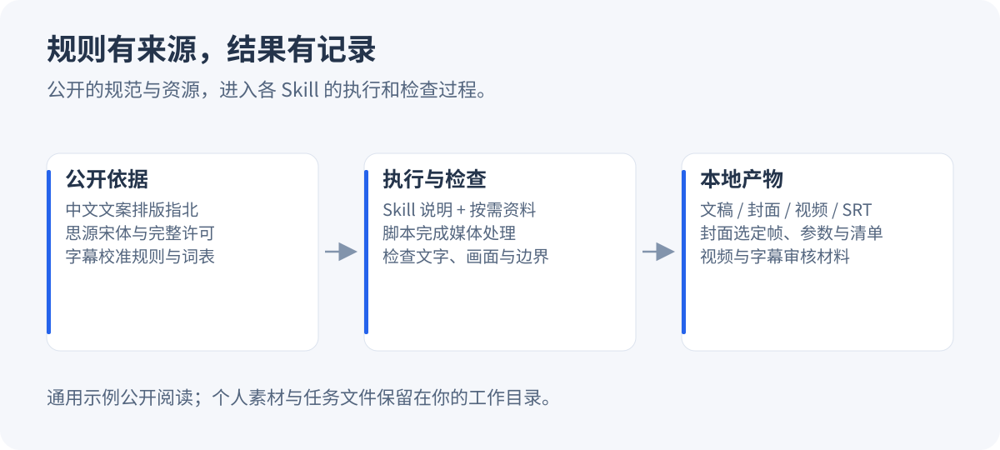

# creator-tools

简体中文

> 面向自媒体创作者的中文 AI Skills 工具箱。把原始视频、字幕、封面文字和文稿交给 Agent，完成粗剪、字幕校准、多比例封面与中文排版。

[](VERSION)
[](https://skills.sh/bridge-wang/creator-skills)
[](LICENSE)

**支持：Claude Code、Codex，以及其他支持 Skills 的 Agent。**

creator-tools 由 [Bridge](https://github.com/bridge-wang) 创建，将自己学习 AI 和制作内容时反复使用的流程，整理成 3 个可直接调用的 Skills。每个 Skill 独立可用，覆盖视频粗剪、字幕校准、封面制作与文字排版。

**v2.4.0 更新：** 新增中文文案排版，统一中英文空格、组合加号与范围波浪线，保留原文措辞及代码结构。

[快速开始](#快速开始) · [安装](#安装) · [能力一览](#能力一览) · [公开工作流示例](#公开工作流示例) · [完整使用手册](docs/新手入门.md) · [更新记录](https://github.com/bridge-wang/creator-skills/commits/main)



## creator-tools 解决什么问题

把当前的素材和想要的结果一起发给 Agent，就能从对应环节开始。原片先做粗剪，人工精剪完成后再生成最终字幕；封面先看候选再选定；文字排版直接返回整理后的全文。

| 真实处境 | 你会得到 |
| --- | --- |
| 口播录完了，气口和重说很多，又担心删掉必要的屏幕操作 | 粗剪视频、同步审核字幕和剪辑记录 |
| 已经在剪辑软件里精剪完成，需要与当前画面对齐的字幕 | 校准、重锚定和排版后的独立 SRT |
| 手里已有 SRT，但专名、错字和断句需要整理 | 校准后的 SRT；有同时间轴音频时可进一步核对时间 |
| 一条视频要发多个平台，封面总要反复选帧和排字 | 3 张真实画面候选；选定后得到 4 种比例的封面 |
| 文稿里的中文、英文、数字和符号混在一起，排版不统一 | 保留原文措辞、可直接复制的排版结果 |

## 快速开始

安装完成后，直接在 Agent 中输入：

```text
给这个无字幕视频做封面：/path/to/视频.mp4
标题分两行：复杂的事情 · 从简单处开始
先给我三张候选，选定后再生成四种比例。
```

Agent 会检查素材和已有工具，展示 A／B／C 三张候选。回复“选 B”后，它会生成 3:4、9:16、16:9、4:3 四张成品。需要调整时，继续说明标题、取景或样式要求。

已经知道需求时，可以直接调用具体 Skill：

```text
/bri-video-srt 粗剪这条原始口播：/path/to/原片.mp4
/bri-video-srt 视频已经精剪并锁定时间轴，请生成最终字幕：/path/to/成片.mp4
/bri-video-srt 校准这份字幕的专名和断句：/path/to/字幕.srt
/bri-cover-generate 给这个无字幕视频做封面，标题是“先做出来·再慢慢改”：/path/to/视频.mp4
/bri-chinese-typeset 请排版：用检索+生成整理文档，预计4-6分钟。
```

## 能力一览

| 工作目标 | 主要入口 | 常见产出 |
| --- | --- | --- |
| 粗剪原始口播，检查气口、重说与必要操作画面 | `/bri-video-srt` | 粗剪视频、审核 SRT、剪辑时间记录 |
| 为精剪且时间轴锁定的音视频生成字幕 | `/bri-video-srt` | 校准并对齐的最终 SRT |
| 整理已有字幕的专名、文字与断句 | `/bri-video-srt` | 校准后的 SRT |
| 从真实视频画面制作统一风格的多平台封面 | `/bri-cover-generate` | 3 张候选、选定后的 4 比例 PNG 与总览 |
| 整理中文或中英混排文稿 | `/bri-chinese-typeset` | 保留内容的排版全文，或按要求保存的文本文件 |

完整的 3 个 Skill、所需素材、运行依赖和使用边界，见 [新手入门与 Skill 全目录](docs/新手入门.md#skill-全目录)。

## 安装

### 推荐：Claude Code、Codex 与其他支持 Skills 的 Agent

在终端执行：

```bash
npx -y skills add bridge-wang/creator-skills -g --all
```

安装后回到 Agent，把素材和需求一起发出，或直接输入 Skill 名称。通过这个命令安装需要 Node.js／npx；视频与封面的运行依赖见 [环境准备](docs/新手入门.md#环境准备)。

### Claude Code 插件市场

也可以通过 Claude Code 插件市场安装所需能力：

```bash
claude plugin marketplace add bridge-wang/creator-skills
claude plugin install bri-video-srt@creator-tools
claude plugin install bri-cover-generate@creator-tools
claude plugin install bri-chinese-typeset@creator-tools
```

当前市场提供 3 个独立插件，按需选择对应的安装命令。使用插件方式安装后，可在 Claude Code 的命令列表中选择相应 Skill。

只想通过 skills CLI 安装一个能力时，可使用 `npx -y skills add bridge-wang/creator-skills -g --skill bri-chinese-typeset -y`，将 Skill 名换成所需能力即可。



### 更新

已安装 creator-tools 时，直接对当前 Agent 说：

```text
更新 creator-tools：https://github.com/bridge-wang/creator-skills
请先检查并保留我修改过的词表、保护短语和任务文件。
```

Agent 应先核对本地修改，再更新对应 Skill；视频、封面与文稿仍放在你的工作目录中。插件市场的更新命令见 [安装与更新](docs/新手入门.md#安装与更新)，版本变化见 [提交记录](https://github.com/bridge-wang/creator-skills/commits/main)。

## creator-tools 怎样工作

```text
提供素材与当前需求
   ↓
Agent 匹配对应 Skill，确认素材所处阶段
   ↓
检查必需输入、已有工具与规则
   ↓
按流程生成阶段结果
   ↓
需要时由你审核粗剪或选择封面
   ↓
交付视频、字幕、封面或排版文字
```

三个 Skill 可以分别使用，不要求从视频流程的第一步开始。粗剪结果需要人工精剪后才能进入最终字幕阶段；封面默认等你选定候选后再出四比例；文稿排版保留内容和原有结构。

## 规则资料与本地记录

仓库公开了字幕校准规则、封面样式与字体依据、中文排版约定，以及用于执行和核对结果的脚本。

- 想统一字幕里的专名，查看 [固定术语表](skills/bri-video-srt/references/fixed_terms.tsv) 与 [保护短语表](skills/bri-video-srt/references/protected_phrases.txt)。
- 想了解字幕怎样校准，阅读 [字幕校准说明](skills/bri-video-srt/references/calibration.md)。
- 想调整封面取景与排字，阅读 [样式与构图规则](skills/bri-cover-generate/references/style-and-framing.md) 和 [字体来源与许可](skills/bri-cover-generate/references/font-license.md)。
- 想了解文字排版及其保护边界，阅读 [排版规则](skills/bri-chinese-typeset/SKILL.md) 与 [结构保护说明](skills/bri-chinese-typeset/references/structured-text.md)。
- 想继续上一次制作，保留本地交付和任务记录：粗剪审核文件位于素材的审核目录；封面使用 `job.json` 与成品清单记录选择和参数，详见 [复现工作流](skills/bri-cover-generate/references/workflow.md)。

音视频转录、抽帧和封面渲染在本地执行。Agent 阅读文稿、字幕或候选图时，这些内容如何传给模型取决于所用客户端及模型配置。

## 公开工作流示例

这里整理了从素材准备到结果验收的通用创作示例，提供两种格式：

- [Markdown 阅读版](docs/创作工作流示例.md)：适合搜索、复制请求，或交给 Agent 参考。
- [PDF 阅读版](docs/创作工作流示例.pdf)：适合完整阅读和下载保存。

示例与 Skills 的运行资源分开放置。安装器部署的是所选 Skill 目录；这两份阅读材料保留在仓库 `docs/` 中，可单独下载。示例不包含个人原始视频、私有文稿或开发测试答案。



## 共同贡献者

仓库维护与贡献记录可在 [贡献者页面](https://github.com/bridge-wang/creator-skills/graphs/contributors) 查看。以下上游项目为工具箱提供了公开规则与资源：

- [sparanoid / 中文文案排版指北](https://github.com/sparanoid/chinese-copywriting-guidelines)：中文混排的基础规则。
- [Adobe Fonts / Source Han Serif](https://github.com/adobe-fonts/source-han-serif)：封面使用的思源宋体及其许可。

## 作者与支持

作者：[Bridge](https://github.com/bridge-wang) · [X / Twitter](https://x.com/qc777qc) · [小红书](https://www.xiaohongshu.com/user/profile/688d628f00000000280138bf?xsec_token=AB4JtVBOAy96vRmfZj93Qqd4JCfrPiHVfZrLW18oCy9Ys=&xsec_source=pc_followed) · [抖音](https://www.douyin.com/user/MS4wLjABAAAAAenxARmGNjE5BPKN3pvZmO6Rdzd7N0LAAwPdviXAPFyOf7kPmoJvVY7BzZiKtvKQ?from_tab_name=main)

使用中遇到问题，或希望补充新的创作流程，可以在 [GitHub Issues](https://github.com/bridge-wang/creator-skills/issues) 提交素材类型、预期结果和问题描述。

## 许可证

代码和文档采用 [MIT](LICENSE) 许可证。

- 可以按 MIT 条款使用、修改和分发，包括商业用途。
- 再分发代码和文档时，保留版权声明与许可证。
- 内置思源宋体单独遵循 [SIL Open Font License 1.1](skills/bri-cover-generate/assets/fonts/LICENSE.txt)。字体使用与再分发边界见 [字体许可说明](skills/bri-cover-generate/references/font-license.md)。
