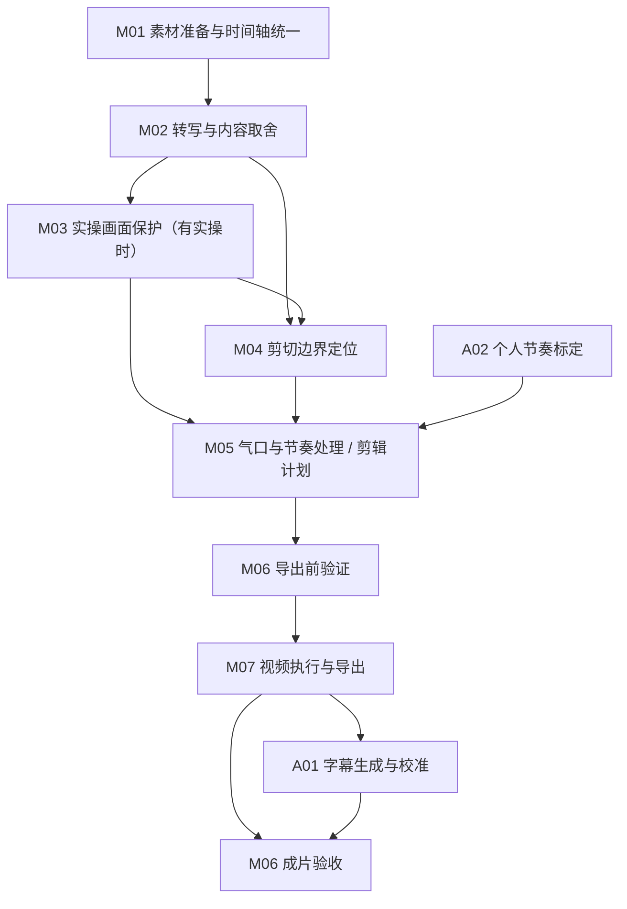

# 流程架构与模块边界

查看架构或修改 Skill 时读取；修改前同时读取 [反馈修复与评测](evaluation.md)。日常执行按 [主入口](../SKILL.md) 路由到对应流程。

- M06 在导出前、后分别执行，属于同一个验证模块。发现失败时回到责任模块修复，不把所有问题归给 M06。
- 纯人物口播跳过 M03；A02 在标定或调整偏好时运行，其配置供后续剪辑使用。
- 仅生成最终字幕时直接进入 A01，不触发粗剪；仅测试文字取舍时运行 M01、M02 即可。
- `SKILL.md` 和 `references/roughcut.md` 负责路由与编排，不另设一个可以任意改动所有模块的“总模块”。

## 七个核心模块

| 编号与模块 | 负责的问题 | 输入 → 输出 | 规则与主要实现位置 |
|---|---|---|---|
| **M01 素材准备与时间轴统一** | 音频、文字和视频是否指向同一源时间；素材是否可处理 | 源视频 → 媒体参数、对齐的 16 kHz 单声道 PCM16 音频 | [粗剪流程](roughcut.md) 第 1 节的探测与抽轨；[check_setup.sh](../scripts/check_setup.sh) |
| **M02 转写与内容取舍** | 说了什么；哪些表达是重录；哪一遍保留 | 对齐音频 → 原始转写 → 独立子 Agent 的原文选择 → 主 Agent 原音复核后的语义删除意图 | [全文审稿](transcript-reader.md)；[transcript_selection.py](../scripts/transcript_selection.py)、[semantic_review.py](../scripts/semantic_review.py)；粗剪流程中的 Whisper 调用和第 2 节 |
| **M03 实操画面保护** | 没说话时，哪些操作过程仍必须让观众看见 | 原视频、转写、停顿候选 → 有画面证据的最小保护窗口 | [操作停顿审核](operation-pauses.md)；[pause_visual_audit.py](../scripts/pause_visual_audit.py) |
| **M04 剪切边界定位** | 已决定删除的内容，准确从哪里切到哪里，才能不削字、不留错句 | 语义删除意图、原音、保护区间 → 精确删除区间与前后原话锚点 | 粗剪流程第 3 节；[候选格式](roughcut-candidates.example.json)；[roughcut_preflight.py](../scripts/roughcut_preflight.py) 的边界解析与区间应用 |
| **M05 气口与节奏处理** | 重说删除后，拼接处停多久；怎样生成完整保留时间轴 | 已确认删除区间、真实静音、保护窗口、节奏配置 → 完整 `cutlist` | [节奏执行规则](pacing.md)；[autocut.py](../scripts/autocut.py) 的气口压缩、补白、区间合并与计划生成；[pause_profile.py](../scripts/pause_profile.py) 的声学测量 |
| **M06 剪辑验证** | 删除决定是否落实；切口、气口、字幕和实际成片是否满足要求 | 短预览、整片音频预览、成片与对应记录 → 通过/失败证据及问题位置 | [roughcut_preflight.py](../scripts/roughcut_preflight.py) 的预览与验证；[roughcut_inspect.py](../scripts/roughcut_inspect.py) 的成片检查 |
| **M07 视频执行与导出** | 如何准确执行通过验证的剪辑计划 | 原视频、已验证 `cutlist` → 同步裁切、拼接和编码后的粗剪视频 | [autocut.py](../scripts/autocut.py) 的成对裁切、拼接、编码与导出部分 |

## 两个配套模块

| 编号与模块 | 职责与边界 | 规则与主要实现位置 |
|---|---|---|
| **A01 字幕生成与校准** | 根据最终媒体生成同轴字幕，处理识别错误、术语、断句、长度、排版和重锚定；不决定重新剪掉视频中的话 | [最终字幕流程](final-subtitles.md)、[校准规则](calibration.md)；`review_srt_pipeline.py`、`srt_calibrate.py`、`srt_audio_reanchor.py`、`zh_typography.py`；术语和受保护短语词表 |
| **A02 个人节奏标定** | 从用户参考或明确偏好中确定节奏标准；M05 负责执行这个标准 | [节奏标定](pacing.md)、[节奏配置](pacing-profiles.json)；`pause_profile.py` 的参考样本统计 |

## 内容取舍与实际剪切的边界

M02 使用大语言模型理解全文，统一处理整段重录、单句纠错和句内重启。确认同一内容重录后，默认以后一次完整版本为基准；必要条件缺失、后一次未完成等情况按全文审稿规则处理。固定规则负责来源、覆盖和引用检查，不用字面相似度或固定时间窗口代替语义判断。

M04 根据 M02 的意图确定安全切口，M07 才实际裁掉相应的人声和画面。M05 主要压缩普通静音。原音若表明文字取舍有误，须退回 M02 更新决定并记录依据；不能在后续模块中偷偷加入新的内容取舍规则。

## 模块不等于文件

现有代码尚未完全按职责分文件。定位后的修改范围要精确到文档章节、函数或分支；共享一个文件不意味着可以一起修改。

| 共享位置 | 必须分开的职责 |
|---|---|
| `roughcut_preflight.py` | `resolve_ranges`、`apply_ranges` 的边界处理属于 M04；`write_preview`、`write_kept_preview`、`validate_preview`、`validate_final`、`validate_silence` 的预览和检查属于 M06 |
| `autocut.py` | `cap_acoustic_pauses`、`add_benchmark_padding` 及 `main` 中保留区间计划属于 M05；`build_paired_concat_filter` 和 ffmpeg 编码执行属于 M07；检查入口不能被用来绕过已有验证 |
| `pause_profile.py` / `pacing.md` | 从参考决定标准属于 A02；在本次素材上测量、执行该标准属于 M05。为修复执行错误而改动用户标准，属于改错模块 |
| `roughcut.md` | 包含多个模块的调用顺序和命令。只同步目标模块对应的调用说明，不顺带重写其他阶段 |

## 架构维护

新增模块、改变职责或调整模块之间的数据交接时，再更新本文的架构表与流程图。普通剪辑问题修复只更新目标模块及本次评测记录，不需要重写整个架构。节奏数值以配置文件为唯一来源，具体语义取舍以全文审稿规则为准，本文保存职责边界，修改细则见 [反馈修复与评测](evaluation.md)；不重复维护各模块的具体参数和语义细则。
